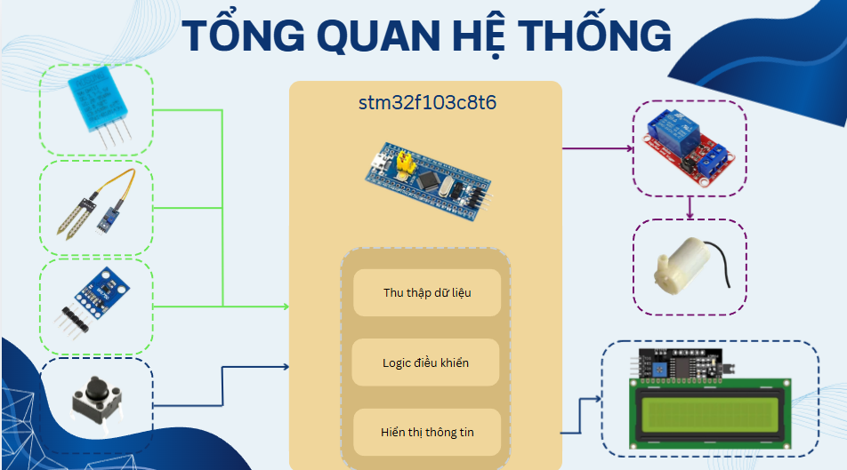
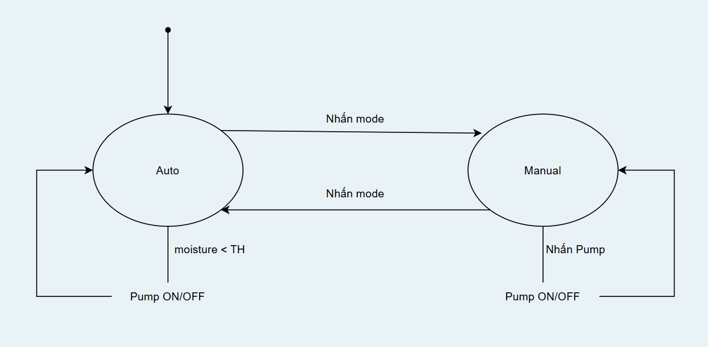
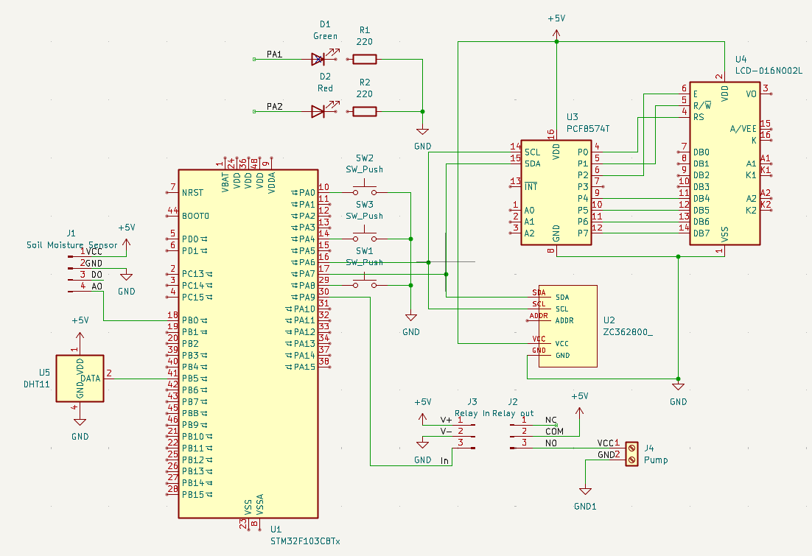

# Smart Irrigation System

Hệ thống tưới tiêu thông minh đa cảm biến dựa trên giám sát môi trường và điều khiển bơm tự động

## Tính năng

- Đo độ ẩm đất bằng Soil Moisture Sensor
- Đo nhiệt độ và độ ẩm bằng DHT11
- Đo cường độ ánh sáng bằng BH1750
- Hiển thị thông tin trên LCD 20x4
- Chế độ AUTO:
    + Tự động bật/tắt bơm dựa trên ngưỡng độ ẩm đất đặt trước và tự động hiển thị cảm biến lên LCD
- Chế độ MANUAL:
    + Điều khiển bơm bằng nút nhấn và Relay, đọc các giá trị cảm biến thông qua nút nhấn

## Phần cứng

- MCU: STM32F103C8T6
- Cảm biến độ ẩm không khí, nhiệt độ: DHT11
- Cảm biến ánh sáng: BH1750
- Cảm biến độ ẩm đất: Soil Moisture Sensor
- Hiển thị: LCD 20x4 I2C
- Relay Module
- Water Pump
- 3 Push Buttons

## Tổng quan hệ thống

## Control FSM

## Sơ đồ kết nối

# Demo video

▶️https://youtu.be/Lm8nARhssnc?si=MTAc85anRcH3JVYW

## Build and Flash

Toolchain: arm-none-eabi-gcc.
Build system: Makefile.
Programmer: ST-Link.

## Hạn chế và hướng phát triển

### Hạn chế

* Hệ thống hiện tại chỉ hoạt động trong phạm vi cục bộ, chưa hỗ trợ giám sát và điều khiển từ xa.
* Việc đo độ ẩm đất, nhiệt độ, độ ẩm không khí và cường độ ánh sáng vẫn phụ thuộc vào độ chính xác của các cảm biến.
* Máy bơm hiện chỉ được điều khiển theo hai trạng thái **ON/OFF**, chưa có khả năng điều chỉnh lưu lượng nước.
* Dữ liệu cảm biến chưa được lưu trữ để theo dõi và phân tích trong thời gian dài.

### Hướng phát triển

* Tích hợp kết nối Wi-Fi để giám sát và điều khiển hệ thống từ xa.
* Xây dựng ứng dụng hoặc giao diện web để theo dõi các thông số của hệ thống.
* Bổ sung chức năng lưu trữ và biểu diễn dữ liệu cảm biến theo thời gian.
* Phát triển chức năng lập lịch tưới và tối ưu thuật toán điều khiển bơm.
* Sử dụng PWM kết hợp với mạch điều khiển phù hợp để điều chỉnh lưu lượng bơm.
* Bổ sung cơ chế phát hiện lỗi cảm biến và các chức năng bảo vệ nhằm tăng độ ổn định của hệ thống.

## Tác giả
Nhóm 2